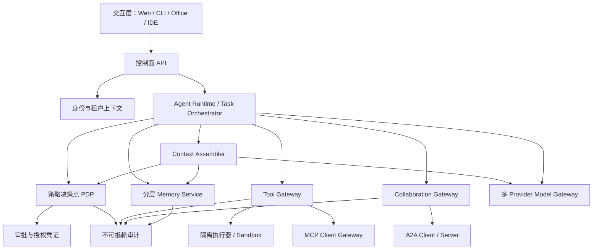
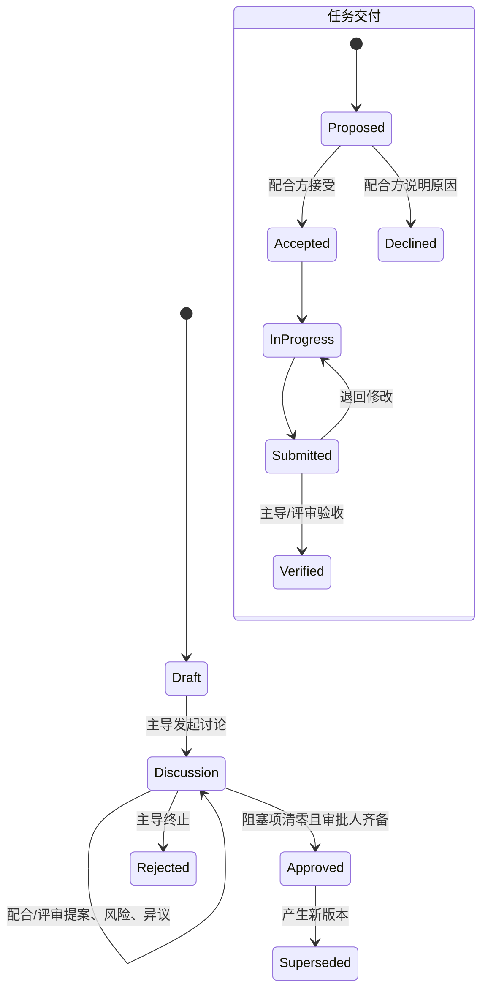

# 总体架构

## 1. 设计原则

系统采用“模型负责推理，Harness 负责可验证执行”的边界。模型输出永远只是请求，不是授权。
所有工具调用、记忆写入、跨团队共享和外部副作用都必须经过确定性的策略、预算、审批和审计管线。

参考项目中保留的关键思想：

- `learn-claude-code`：单一 Agent Loop、按需 Skills、工具注册、上下文压缩、任务与异步协作；
- Pi：provider/runtime/UI 分层、结构化事件、上下文变换、steering/follow-up、工具前后置钩子；
- 不继承它们的本地单用户信任假设。租户隔离、信息流控制和审计属于内核能力，而不是可选插件。

## 2. 逻辑分层

## 3. 部署边界

- **控制面**：身份、租户、策略、任务、审批、Agent Card/能力目录。
- **执行面**：Agent Loop、工具执行器、模型网关、MCP/A2A 适配器。
- **数据面**：会话、任务、记忆、制品、审计。每条记录必须带 `tenant_id` 与安全标签。
- **连接器面**：Git、文档、邮件、日历、知识库等连接器使用独立服务身份和最小 OAuth scope。

办公连接器以每租户 Tool Worker 为秘密边界。Agent 只看到目录 ID 和固定操作；origin、OAuth scope、
Secret 与允许路径位于部署目录，默认不跨租户加载。通用网关实现固定 HTTPS origin、禁重定向、响应
限额、供应商幂等与熔断；真实 SaaS 通过受审阅适配器映射到该固定契约，并由 egress proxy 限制 DNS。

生产部署以容器/微虚拟机作为代码和不可信工具的安全边界。Python 进程内的路径检查、提示词规则或
工具描述不能替代 OS 级隔离。

## 4. 核心协议

- MCP 网关当前使用官方 Python SDK `1.28.x` 的稳定协议集合（最高 `2025-11-25`），通过
  Streamable HTTP 做能力协商。`2026-07-28` 兼容层将在官方 Python SDK v2 达到稳定版后启用，
  当前不会把预发布依赖伪装成生产支持。
- A2A 跟随 `1.0`：Agent Card 发现、版本头、长任务、流式/异步更新和标准 Web 安全机制。
- 内部事件采用版本化 envelope：`event_id`、`tenant_id`、`correlation_id`、`causation_id`、
  `schema_version`、`occurred_at`、幂等键。
- 跨团队共享只传递明确发布的制品或消息，不传递对方 Agent 的内部记忆、工具、系统提示或实现细节。

## 5. 协作治理

协作角色与系统安全角色分离：

- **主导（lead）**：提出目标、维护计划、组织讨论、拆解并提出任务分派、处理依赖和验收交付；
- **配合（contributor）**：参与计划讨论、提出方案/风险/异议、接受或拒绝任务、执行并提交契约化交付物；
- **评审（reviewer）**：参与讨论、解决独立评审项、验收交付物；
- **观察（observer）**：仅查看已经授权共享的治理信息。

主导不是超级管理员。主导的计划权不能绕过数据标签、工具审批、租户边界或披露授权。计划在讨论阶段允许
配合方提出阻塞异议；异议必须由提出方或独立评审方解决。计划只有在无未解决阻塞项且全部约定审批人对
同一内容摘要批准后才被冻结。任务分派是提议而不是强制命令，配合方可以带理由拒绝；被接受的任务按
`accepted → in_progress → submitted → verified` 推进。

## 6. 可靠性

- 工具和消息边界采用持久化原子幂等键；相同请求重试被抑制，相同键更换内容被判定为冲突。
- Tool Job 参数与结果按租户加密；Agent/Tool Worker 通过数据库租约和 fencing token 分离。连接器必须
  将调用级稳定幂等键传给外部服务；不支持幂等的副作用接口需专用补偿或人工确认，不能宣称恰好一次。
- 模型的一次并行 Tool Call 批次先完整预检；高风险调用逐项审批，未全部获准前不派发任何副作用。
  批次和 Agent checkpoint 原子落库，Run 进入 `awaiting_tool`；全部结果完成后由协调器原子写回并唤醒。
  多轮批次按 checkpoint 中的待派发集合聚合，不会混入历史 Job。
- 外部调用采用有限重试、指数退避、熔断、超时和总预算。
- 长任务持久化状态机，不依赖单进程内线程存活。
- Agent Run 检查点按租户加密并绑定状态版本；Run 领取采用租约 fencing，SSE 以连续事件序号支持
  `Last-Event-ID` 断线续传。WebSocket steering/follow-up 先持久化密文指令，再在轮次边界读取；指令
  状态和 checkpoint 原子提交，完成竞态会重新排队而不是丢失新工作。
- 执行任务以 PostgreSQL DAG 持久化；领取使用 `FOR UPDATE SKIP LOCKED`，租约令牌作为 fencing
  token，心跳续租。租约过期后按尝试预算恢复到重试队列或失败，取消中的运行任务必须由 Worker
  显式确认，旧 Worker 不能用失效令牌提交结果。
- 事件采用 outbox/inbox 模式；消费者至少一次投递、业务处理幂等。
- 治理事件与 Outbox 在同一事务生成；发送 Relay 通过 producer-scoped RLS、`SKIP LOCKED` 和
  fencing token 领取。网络确认前崩溃会造成安全的重复投递，而不是消息丢失；接收端先校验签名、
  收件租户、时间新鲜度和内容摘要，再通过 Inbox 主键和 envelope 摘要原子去重。
- Agent Loop 强制最大轮数、工具调用数、token/cost/时间预算，防止无限循环和 Denial of Wallet。
- 高风险工具使用持久化审批：审批与请求摘要、安全标签、执行人和工具精确绑定，审批人必须具备独立
  `tool_approver` 角色及足够 clearance/compartment；消费与 execution ID 绑定并防止跨执行重放。

## 7. 当前纵向切片

`src/coifesp_harness` 已把策略、工具管线、审计、Agent Loop、Skills、加密 Memory 和协作网关打通。
Memory 已使用 PostgreSQL 版本化迁移、强制 RLS 和原子幂等写入；SQLite 只作为测试与本地开发适配器。
Memory 与不可变审计已经使用 PostgreSQL 版本化迁移、强制 RLS、受限运行账号和真实数据库冒烟验证。
审计事件按租户串行化为带版本密钥签名的哈希链，数据库拒绝更新、删除和截断；对象存储 WORM 留存和
跨区域灾备仍属于后续上线工作。本地 Keycloak 已完成真实 OIDC、Worker client-credentials 和最小权限
目录解析验收；公网部署仍要求 HTTPS/WSS、证书和生产密钥管理，系统不会用弱认证替代。

协作治理状态已经规范化持久化到 PostgreSQL，并具备乐观并发、命令幂等、事件日志、事务 Outbox、
跨团队显式可见性和主导/配合/评审职责约束。MCP 网关只注册本地管理员明确配置了角色、风险、超时和
输出上限的远端工具；远端描述不能扩权。A2A 1.0 模块使用官方 SDK 的 Agent Card 类型，实施 HTTPS、
版本、传输和认证要求校验，并把治理任务缩减为显式交付契约后再交换。A2A 业务路由的授权与持久化
纵向切片尚未完成，因此暂不对外挂载。编程和办公交付统一使用持久化的制品 manifest registry，清单带
SHA-256、来源、安全标签、显式租户可见范围和幂等发布，并以强制 RLS 及签名审计保护；治理提交通过
`artifact://owner/id?sha256=...` 精确验证。只读本地 Git commit 适配器已完成，真实 Office/对象存储以及
远程 Git OAuth 连接器仍需在后续纵向切片中实现并联调。

持久化执行面已经增加治理任务到 Worker 的安全边界：只有治理记录中的实际配合方且任务处于
`in_progress` 才能创建执行任务；只有带 `execution_worker` 角色的服务身份才能领取、续租或完成任务。
任务、DAG 依赖和追加式执行事件均受强制 RLS 保护，执行事件与签名审计在同一事务提交。

跨团队治理事件现在具备完整的 durable Outbox/Inbox 路径。发布前对结构化事件再次执行秘密脱敏，
envelope 使用规范化 JSON 与 HMAC 完整性签名；发布、租约恢复、接收和处理完成都写入对应租户的签名
审计链。发送失败按有限预算重试并最终进入 dead letter；接收处理失败同样按预算重试并最终拒绝。
真实 A2A 网络路由仍保持暂停。本地 OIDC 已经完成验收；后续需要实现协议业务路由、OIDC 上下文适配
和持久 TaskStore，再把该持久传输层接到 A2A HTTP+JSON/JSON-RPC 适配器。精确边界见
[MCP / A2A 协议实施基线](protocol-implementation-baseline.md)。

Agent Loop 现在通过统一 Context Assembler 调用模型。补充上下文逐项携带租户标签、来源、内容摘要、
内容可信度和独立的指令可信度；跨租户读取需要与用途精确匹配的披露授权。Memory、文档、A2A、Skills
和工具输出只能作为 JSON 数据进入模型，不能提升成系统指令。预算按完整渲染消息计算，溢出内容生成
带 source ID、SHA-256 和完整性标记的可追溯压缩记录；对话本身超限时要求先做受审核 checkpoint，
不会静默裁剪关键约束。

高风险工具审批现已持久化到 PostgreSQL，并提供申请、读取、批准/拒绝和撤销 API。申请人与审批人
职责分离，决定使用乐观版本，过期审批自动失效；成功消费后只有同一 `execution_id` 的恢复重试可以
重取结果。高风险工具必须由本地策略声明 allowlist 审阅投影，投影从已验证参数生成并按字段选择明文、
摘要、计数或完全遮蔽；远端 MCP 描述和调用者都不能定义投影。Agent Loop 在等待审批时生成可恢复
checkpoint，并跨恢复累计运行预算。ToolExecutor 在配置持久化 ApprovalService 后拒绝进程内伪造或
manual origin 的 Approval。

控制面现已接入供应商无关 OpenTelemetry Trace、Prometheus Metrics 和 JSON Log。HTTP Trace 与指标
只使用路由模板和状态类别；Worker 指标只使用规范化 outcome/error code，不按租户、Run 或用户打
标签。Metrics 在生产环境要求独立 Bearer Token，日志在输出前执行秘密脱敏且异常只保留类型。签名
审计仍是独立的完整证据链，不能由采样 Trace 或可轮转运营日志替代。

Agent Loop 的外层运行状态现已持久化为加密 Agent Run。控制面与 Worker 通过明确角色分离，领取、
启动、心跳和检查点提交使用不可预测租约 token 防止旧 Worker 写入；审批恢复先验证持久化
tool-managed 审批已批准，再由服务端修改既有密文检查点。追加式生命周期事件不包含提示词或工具
参数，并提供 SSE cursor 续传。Durable Worker 从身份目录重新解析当前主体，不信任检查点内身份；
长调用后台续租，瞬态失败以数据库失败预算和指数退避重试，预算或确定性错误保存实际用量后终止。
任务 owner/controller 可通过强制 `coifesp.control.v1` 子协议的 WebSocket 提交 steering/follow-up；连接
复用 OIDC Bearer 边界且不接受 URL Token，确认、生命周期事件和日志不回显指令正文。PostgreSQL 对
指令实施强制 RLS、密文内容不可变、终态不可变和禁止删除。
真实 Agent Worker 已使用本地 Keycloak、PostgreSQL 和 DeepSeek 完成端到端运行验收。独立 Tool
Worker 的持久任务内核、Agent Run 原子等待/唤醒、独立 OAuth 入口和 OCI sandbox 后端已完成；本地
真实 OAuth 身份与 Docker Desktop/WSL2 容器隔离也已完成验收。公网部署仍必须配置 HTTPS/WSS、生产
Secret 管理、受控镜像和 egress 策略；Tool Worker 继续拒绝无 sandbox 配置启动。
